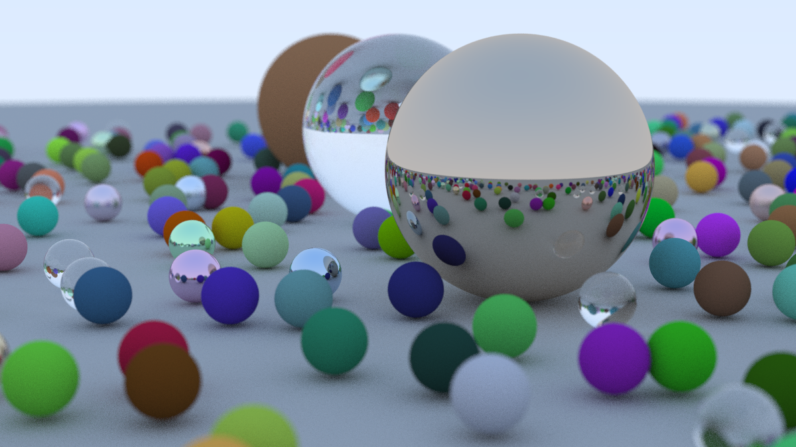
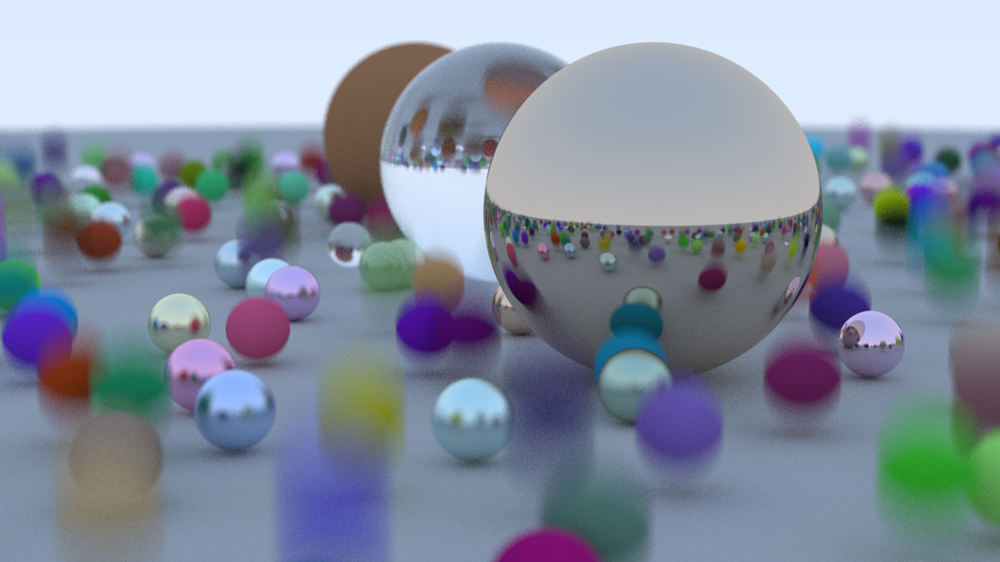

# Ray Tracing in One Weekend
_Codon edition_


_Final render of Book 1 at 100 samples per pixel, depth of 50, width of 1200, rendered in 41:16 using Codon on a 2019 2.6 GHz Core i7 MacBook_

## Performance benchmarks

The scene being tested is just before Chapter 4 of Book 2 starts:


_100 samples per pixel, depth of 50, width of 1200, BVH enabled, rendered in 3:03 using Codon_

Renders are done on a 2019 MacBook with a 2.6 GHz Intel Core i7

| Setting            | Value     |
| ------------------ | --------: |
| Width              | 400       |
| Samples per pixels | 100       |
| Max depth          | 50        |
| Motion blur        | ON        |

### Without BVH

Commit: `7ced295` with BVH disabled

| Implementation | Render time | Relative |
| -------------- | ----------: | -------: |
| PyPy           | 04:50       |     1.0x |
| Codon          | 11:05       |     2.3x |
| Python         | DNF         |      inf |

For some reason, PyPy beats Codon when BVH is disabled.

### With BVH

Commit: `7ced295`

| Implementation | Render time | Relative | Previous best |
| -------------- | ----------: | -------: | ------------: |
| Codon          | 00:19       |     1.0x |        0.06x  |
| PyPy           | 02:44       |     8.6x |        0.56x  |
| Python         | 26:09       |    82.6x |        5.41x  |

BVH provides a huge boost in performance, and awakens Codon's power.

## Goal

I recently came across an interesting [blog post](https://16bpp.net/blog/post/the-performance-impact-of-cpp-final-keyword/) on Reddit which mentioned a [series of free online books about Ray Tracing](https://raytracing.github.io/). I've previously dabbled in homemade ray tracing multiple times and in various forms (Java, C++, GLSL), so the book was not really for me, but I skimmed through nonetheless.

It was well written and I thought to myself, what if I followed this book not to learn ray tracing but a new language or cool piece of tech?

So I decided to go with [Codon](https://github.com/exaloop/codon), a Python implementation that compiles to native code, and see how performant I can get a ray tracer to be while staying reasonably pythonic.

## Requirements

You'll need a development build of Codon, as the latest release (v0.16.3) is about a year old, and contains some breaking inheritance bugs.

Install Codon normally by following the official instructions, then go to [Codon's CI builds](https://github.com/exaloop/codon/actions/workflows/ci.yml), click the latest build, go on the build corresponding to your OS, expand the "Upload Artifacts" step and download the link at the bottom of the log. Extract all the folders (`bin`, `include`, `lib` and `python`) in `~/.codon/` and you should be good to go.

### Optional

To run the profiling script `profile.sh`, first clone the [FlameGraph](https://github.com/brendangregg/FlameGraph) repo:

```
git clone git@github.com:brendangregg/FlameGraph.git flamegraph
```

## Codon

TODO: Write

- Inheritance still shaky
- Errors are not so nice
- Runtime errors are worse, but running the same code in PyPy or Python helps a lot
- Performance is weird
- @par doesn't help
- Mutually referencing classes don't work

## Improvement Ideas

NOTE: Mark every non-book addition clearly

- Orthograpgic camera
    - Instead of projecting all the rays from one single point (or the defocus disks), have a "camera plane" that is parallel to the focal plane, with identical sized pixels, and each pixel's ray would start in its corresponding pixel camera plane. Defocus can be done on a disk around that camera plane's pixel
- Instead of a single color passed to the camera as background color, make a Skybox class that takes a ray and returns a color. This way we can have both the single color background and the original sky gradient
    - This means we can also implement image skyboxes
- After implementing quads, also implement:
    - Infinite plane
    - Disks
    - Triangles
    - Billboard images with transparency
